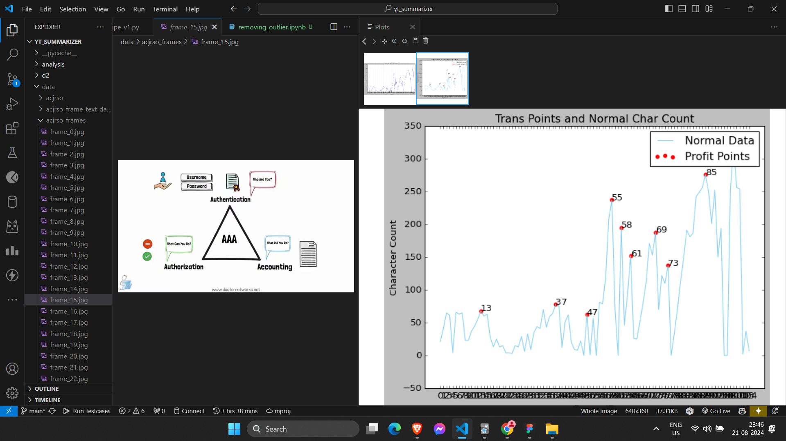

# Most Information Frame Extractor

Pass a YouTube Video link and get the screenshots of the frame which has the most information content (like if someone is explaining with the help of a PPT, capture screenshot when all the text of one slide of PPT has animated in)

Frame with most information it can possibly have


This frame can have more information and thus not the most information frame


# How

The approach I have taken in this code is to perform frame-by-frame analysis of a video to extract text using Optical Character Recognition (OCR) and save only the frames that contain significant changes or improvements in the text content.

The main steps involved in this approach are:

1. Frame Reading: The script reads frames from the video file at a specified interval (e.g., every second, every frame, etc.) using OpenCV's cv2.VideoCapture.
2. Frame Difference Calculation: For each frame, the script calculates the difference between the current frame and the previous frame using OpenCV's point processing techniques. If the difference is below a specified threshold, the frame is considered to have insignificant changes and is skipped.
3. Optical Character Recognition (OCR): If the frame difference is significant, the script performs OCR on the frame using Tesseract OCR engine to extract the text content from the frame.
4. Text Difference Calculation: The extracted text from the current frame is compared with the text from the previous frame using a sequence matcher (difflib.SequenceMatcher). If the text difference is below a specified threshold, the current frame is considered to contain an improvement or new information compared to the previous frame.
5. Frame Saving: If the text difference is significant, the script saves the previous frame with a frame number or timestamp burned onto it, using OpenCV's image writing functions.
6. Iteration: The process repeats for each frame, updating the previous frame and previous text with the current frame and text if the text difference is significant.

This approach allows the script to analyze the video frame-by-frame, identify frames with significant visual and textual changes, and save only those frames that contain improved or new text information. By adjusting the thresholds for frame difference and text difference, the script can be fine-tuned to capture the desired level of changes in the video content.

I used the concept of point processing on images to compare difference in image on pixel level and proceed to compare using text content of the current and previous frame only if the difference is significant on image pixel level.


This way I reduced the redundancy by almost half; 87 frames (see left in the img) with only text content difference comparison and 47 frames (see right in the img) with the aforementioned optimization technique

There is a huge scope of improvement in this project and I would love to work on improving this...But since I have other projects to do as well, I couldn't work on it more for now.

If you would like to contribute/collaborate on this project, kindly ping me at vedantpanchal1345@gmail.com

# Made in 3hrs with Claude.ai

Start Time:
‎04 ‎May ‎2024, ‏‎14:07:39


End Time:
Sat May 4 17:11:13 2024 +0530


https://claude.ai/chat/b8d512fa-ad56-4134-9637-ad94a68a4bc6

Link to the claude chat:
https://aiarchives.org/id/2tB6EgjI2Y6GAxvJgqT0

# Continuing with the work

- mapping the graph
- saving only the frame after which the info content drops

# Update

- Now using a peak word count approach
- It has got even better accuracy with thresholding (currently manual, plan to make it automatic)


# TODO

[v] Write everything again using modular approach and oops approach

[] https://claude.ai/chat/80e72a8e-3db4-4900-b64c-b63b7c891bcc try this curve smoothening

[] https://claude.ai/chat/5f0fb230-e2cf-4f13-b628-02b04c991b0e
Try suggestions mentioned here

# Obstacles

### Obstacle 1

Someone explaning on whiteboard:


vkkjvu_peak_frames: Message Passing Systems (Part 2).mp4

possible solutions:

- smooth something
- dynamic thresholding or something like that

### Obstacle 2

In addition to text slides, footage of the person in between the video:


okhdwp_peak_frames: How I Mastered System Design Interviews.mp4

possible solutions:

- skip the frame where no text and only a person is present

### Obstacle 3

Poor results with background on the screen

### Obstacle 4

https://claude.ai/chat/c89dfb2b-2e96-4912-b484-8adb242b5771

Use multiple images of same thing to remove the obstacle and get clean screenshots
[] Go through the above research papers and try to adapt the techniques to this project

# Using Moving Averages to find the desired frames


Got even better results with the moving averages method
What I did is plot the moving averages of the word count with small window size and large window size then found the intersection of the two curves and took the frame number at that point


Before: 295 frames (has non-max info frames too)
After: 81 frames (has mostly max info frames, few non-max info frames still present)

# Fixes

class InnerTube:
"""Object for interacting with the innertube API."""
def **init**(self, client='ANDROID_CREATOR', use_oauth=False, allow_cache=True):

Regex change in the get throtling function thing

# Update (29/07/2024)

https://claude.ai/chat/179f256d-6896-4158-a3bf-9903b9e92e4e

Trying to use GPU for the processing

```
ERROR: pip's dependency resolver does not currently take into account all the packages that are installed. This behaviour is the source of the following dependency conflicts.
xformers 0.0.25.post1 requires torch==2.2.2, but you have torch 2.0.1+cu117 which is incompatible.
```

might need to fix this

ImportError: PyAV is not installed, and is necessary for the video operations in torchvision.
pip install av

Follow this to look for gpu ocr
https://claude.ai/chat/478fef1c-5b8d-4001-89a7-780d07b4e60a

# Resources for upgrading to GPU

https://www.youtube.com/watch?v=oOIxHDwXY1s
https://www.cse.cuhk.edu.hk/~byu/CMSC5743/2020Fall/slides/T02-OCR-TensorRT.pdf

# Errors to Fix

```
(base) D:\DPythonProjects\yt_summarizer>C:/Users/Vedant/anaconda3/python.exe d:/DPythonProjects/yt_summarizer/gpu_v3.py
Using device: cuda
Enter the URL of the YouTube video (or folder path): pfhpem
Directory 'D:\DPythonProjects\yt_summarizer\data\pfhpem_frames' created successfully.
C:\Users\Vedant\anaconda3\Lib\site-packages\torchvision\io\video.py:161: UserWarning: The pts_unit 'pts' gives wrong results. Please use pts_unit 'sec'.
  warnings.warn("The pts_unit 'pts' gives wrong results. Please use pts_unit 'sec'.")
C:\Users\Vedant\anaconda3\Lib\site-packages\torchvision\transforms\functional.py:1603: UserWarning: The default value of the antialias parameter of all the resizing transforms (Resize(), RandomResizedCrop(), etc.) will change from None to True in v0.17, in order to be consistent across the PIL and Tensor backends. To suppress this warning, directly pass antialias=True (recommended, future default), antialias=None (current default, which means False for Tensors and True for PIL), or antialias=False (only works on Tensors - PIL will still use antialiasing). This also applies if you are using the inference transforms from the models weights: update the call to weights.transforms(antialias=True).
  warnings.warn(
Directory 'D:\DPythonProjects\yt_summarizer\data\pfhpem_frame_text_data' created successfully.
Directory 'D:\DPythonProjects\yt_summarizer\data\pfhpem_plot' created successfully.
OMP: Error #15: Initializing libiomp5md.dll, but found libiomp5md.dll already initialized.
OMP: Hint This means that multiple copies of the OpenMP runtime have been linked into the program. That is dangerous, since it can degrade performance or cause incorrect results. The best thing to do is to ensure that only a single OpenMP runtime is linked into the process, e.g. by avoiding static linking of the OpenMP runtime in any library. As an unsafe, unsupported, undocumented workaround you can set the environment variable KMP_DUPLICATE_LIB_OK=TRUE to allow the program to continue to execute, but that may cause crashes or silently produce incorrect results. For more information, please see http://www.intel.com/software/products/support/.
```

## Leads

https://claude.ai/chat/75126ab2-61fe-4da6-98ab-235af098df7c

### 𝘔𝘢𝘹𝘪𝘮𝘪𝘻𝘦 𝘗𝘳𝘰𝘧𝘪𝘵 𝘣𝘺 𝘉𝘶𝘺𝘪𝘯𝘨 𝘢𝘯𝘥 𝘚𝘦𝘭𝘭𝘪𝘯𝘨 𝘢 𝘚𝘵𝘰𝘤𝘬 𝘢𝘵 𝘮𝘰𝘴𝘵 𝘒 𝘛𝘪𝘮𝘦𝘴


Nice results

### You need to take time as weight and scale the char count too



The OCR can make mistake and mistakenly score the next frame with more data as having less data than the previous frame. And this data when passed to the Maximise Profit function can give wrong results. So, we need to scale the char count with time as weight to get better results.


Popup in the video can also wrongly come in the OCR char count

### Using specialized software for person-free frames:

Photoshop: Use the "Stack Mode" feature in the "Statistics" script.
GIMP: Use the "Median Stack" plugin.
ImageMagick: Use the command-line tool with the "median" option.

https://claude.ai/chat/c2bc0976-d763-4056-97dc-431b22d8675b

### How many slides there could be?

```
The number of slides in a 10-minute educational video can vary significantly depending on several factors:

Presentation style: Some educators prefer to spend more time explaining each slide, while others may use more slides with less time on each.
Subject matter: Complex topics might require fewer slides with more explanation, while simpler topics could allow for more rapid progression.
Visual content: Slides with graphs, images, or diagrams may need more time for explanation compared to text-only slides.
Audience level: Presentations for beginners might move slower than those for advanced students.
Teaching objectives: Some lessons might focus on discussion, requiring fewer slides, while others might be more information-dense.

Given these variables, a rough estimate for a 10-minute video could range from:

Minimum: About 5-10 slides (spending 1-2 minutes per slide)
Average: Around 15-20 slides (spending 30-40 seconds per slide)
Maximum: Up to 30-40 slides (spending 15-20 seconds per slide)

The average of 15-20 slides is often considered a good balance for maintaining audience engagement without overwhelming them with information. However, these numbers can vary based on the specific needs of the lesson and the educator's style.
Would you like me to elaborate on any aspect of this estimate?
```

https://claude.ai/chat/30e10190-d4ba-47c8-9c75-38db02a8f090

## Update 22/09/2024


- Created `pipe_v2.py` to modularize logic
- The OCR part is now made swappable
- Currently supporting `tesseract` and `easyocr`
- Way better results that previous `peak_frames` method
- Before -> 19 frames | After -> 16 frames

  
