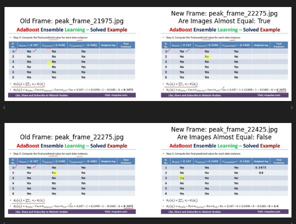
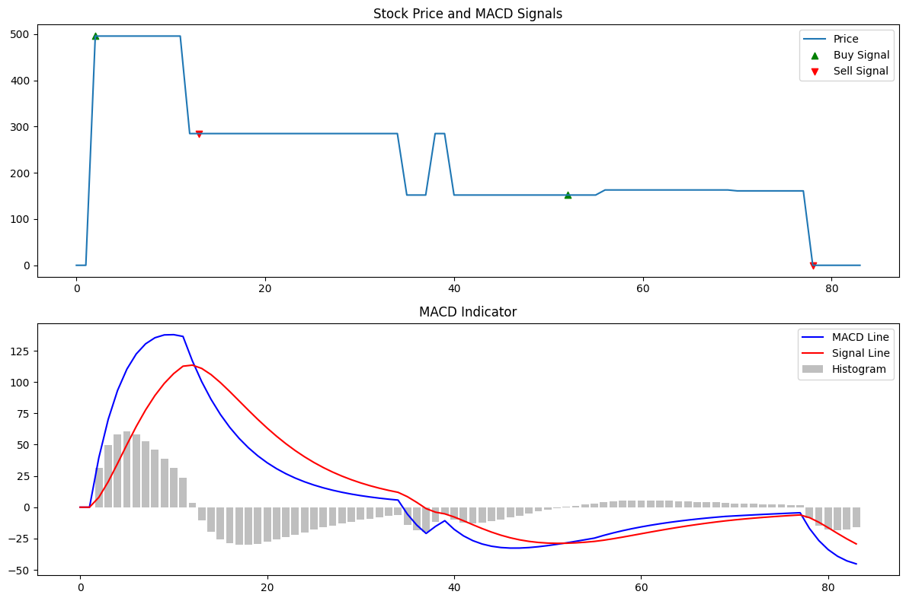

### Outline for IEEE Transactions on Learning Technologies Research Paper

#### **1. Abstract**

- All of the learning these days majorly takes place through the medium of YouTube video and typical of those are the ones where a presenter teaches with slides. This project extract these key slides from such videos efficiently. This is done by identifying peak points in the temporal signal generated by calculating the length of textual content found using OCR on frames ingested frame by frame. We employed and compared results of various peak detection algorithm and also made analogy to stock market trading strategy to identify peak points. We found that the profit maximization method gave the best results. This project can be used to summarize educational videos and help students navigate through the content easily which is especially important for last moment revision for examinations.

#### **2. Introduction**

- **Problem Statement**:
  With most of the learning happening via educational videos on YouTube which are typically taught using slides, many summarization tools have thus emerged. Many of them give an LLM generated summary but they are devoid of the diagrams and equations that are shown in the video.
  To address this, we embarked on to build a tool that efficiently extracts "key frames" the frames of the video that has the maximum informational contain that it can contain.
- **Objective**:
  - The goal is to autonomously identify as less as frames possible without missing any important information and extract these key frames.
  - We believe this will not only help in streamlined content consumption but also will help you get a preview of the video and you'd be better able to decide you want to go on to view the entire video or not as not all videos present of YouTube have the quality of content you desire. Thus saving lot of time and mental energy.
- **Contributions**:
  - The differentiating approach that we have taken here is focus on lightweight and efficient extraction. Previous research have employed large ML models for key frame extraction which is not only inefficient time wise but also has heavy operational const.
  - In contrast, we've heavily used peak detection algorithms to detect key frames and signal processing techniques like smoothening and filtering and image processing techniques like pixel-wise comparison to improve the accuracy of the tool.
- **Structure of the Paper**:
  <!-- - TODO: Fill later -->
  - Overview of the following sections.

---

#### **3. Related Work**

- Following approaches have been explored in this domain:

  1. Multimodal Analysis: The Lecture Presentations Multimodal Dataset focuses on understanding multimodal elements in educational videos, combining text, audio, and visual data to extract meaningful insights. This highlights the importance of integrating multiple content forms for comprehensive video summarization.

  2. Automated Analysis: Techniques like those in the Automated Analysis and Indexing of Lecture Videos employ speech-to-text and visual content extraction to create searchable indices, laying the groundwork for structured keyframe-based video summarization.

  3. Deep Learning Approaches: SliTraNet demonstrates the power of Convolutional Neural Networks for detecting slide transitions in lecture videos. This is particularly relevant for educational contexts, where such transitions often signify key changes in content.

  4. Text and Speech Integration: The study on Content-Based Lecture Video Retrieval Using Speech and Video Text Information showcases how combining speech data with on-screen text can improve the retrieval and extraction of relevant video segments.

  5. Sequential Keyframe Extraction: Research like the LMSKE (Large Model-based Sequential Keyframe Extraction) applies similarity matrices and redundancy reduction to identify compact yet informative keyframe sets, demonstrating the efficacy of advanced statistical and deep learning techniques for video summarization. The LMSKE method outperformed other techniques like VSUMM and INCEPTION in metrics such as F1 scores, fidelity, and compression ratio.

  - The main gaps in these researches is lack of simplicity and efficiency. All of the employment of deep learning, clustering algorithms are likely not to produce fast results to the user.
  - And none have tried signal processing methods, specifically peak detection methods to approach this problem.
  - We present a novel approach which uses peak detection algorithms and we've also added a comparative study of the different peak detection algorithms we used in this approach

---

#### **4. Methodology**

- **4.1 Video Processing Pipeline**:
  - open cv is used for ingesting video in the intervals of 3 seconds
- **4.2 Frame Comparison Algorithm**:

```
    @staticmethod
    def are_images_almost_equal(image1: np.ndarray, image2: np.ndarray) -> bool:
        # Convert frames to grayscale
        image1_gray = cv2.cvtColor(image1, cv2.COLOR_BGR2GRAY)
        image2_gray = cv2.cvtColor(image2, cv2.COLOR_BGR2GRAY)

        # Compute the absolute difference between the two frames
        diff = cv2.absdiff(image1_gray, image2_gray)

        # Threshold the difference to get a binary image
        _, thresh = cv2.threshold(diff, 30, 255, cv2.THRESH_BINARY)

        # Calculate the percentage of different pixels
        non_zero_count = cv2.countNonZero(thresh)
        total_pixels = image1_gray.size
        diff_percentage = (non_zero_count / total_pixels) * 100

        # If the difference is less than a certain threshold, consider the frames almost the same
        return diff_percentage < 0.5
```

- A 0.5 percent threshold is found to work empirically. We ran a qualitative experiment to check which threshold works the best. And the type of educational videos we worked with, 0.5 percent threshold works empirically well.
- Example of images equal or not equal
- 
- **4.3 Text Extraction and Signal Generation**:
  - OCR is performed for each of the ingested frames
  - The character count of the extracted text from the OCR is saved frame by frame thus generating a temporal signal of variation in character count
  - For the frames that were found almost equal, the OCR result of previously processed frames were used, thus saving time and computational resources required to perform OCR
- **4.4 Key Frame Selection Methods**:
  - Following methods were explored for key frame selection
    1. Simple Peak Detection
       - This involved comparing a point with neighboring points to decide whether it is a peak or not.
       - If the frame was found to be peak, it was considered as key frame
       - Following were the obstacles of this method
         - This method was not robust enough to handle noisy data
         - The algorithm was not able to differentiate between peaks and noise
         - The algorithm was not able to handle multiple peaks in the data
         - The algorithm was not able to handle the case where the most informative frame was not the peak
    2. Moving Average Convergence Divergence (MACD)
       - We made a analogy with stock market and re thought about key extraction problem as maximize profit given temporal stock price signal
       - The advantage of this approach is that it can I identify key frames from a stream of data (that is it doesn't rely on future data only on past data)
       - It also requires less number of parameters namely longer-term EMA period and shorter-term EMA period only
       - But MACD is good for stock market but not in our case as objective of stock trading is not only to generate profit but also to minimize loss. So sometimes "sell" is marked for points that are not local maximas like shown in the image below
       - 
    3. Profit maximization algorithm
       - We rethought the problem as a profit maximization problem but chose to consider future data as well as current and past data as the future data is valuable.
       - Then we used an optimized version of a back tracking algorithm to maximize profit under the the constraint that you can make only K trades
       - From the interest of our original problem statement, we can think of K as a parameter which could give the K of the most information frames
       - The obstacle here is that manual intervention is needed to specify the value of K after looking at the vizualization of the temporal signal of character count. We observed that we could approximate 1 slide per uptrend in the signal. After plotting the signal, we could visually count how many uptrends are present and decided that to be the value of K.
       - This method gave high quality results deterministically
       - But it does fail to give all of the key frames from a video
    4. ## Peak Prominence
       - The prominence of a peak is the least drop in height necessary in order to get from the summit to any higher terrain. 
       - With proper fine tuning this method is a great way to find out the important peaks.
       - The obstacles in this method is that the prominence level is highly sensitive to the nature of the video and thus needs to be adjusted accordingly.
 

#### **5. Experimental Setup**

- **5.1 Dataset**:
  - Description of educational videos used (length, variety, sources).
- **5.2 Evaluation Metrics**:
  - Key frame informativeness (e.g., text richness, relevance to topic).
  - Comparison with human-selected frames.
- **5.3 Implementation Details**:
  - Tools and libraries (OpenCV, OCR framework, etc.).
  - Hardware and software environment.

---

#### **6. Results and Discussion**

- **6.1 Quantitative Analysis**:
  - Accuracy and precision of selected key frames.
  - Comparison of peak detection methods (tabular or graphical representation).
- **6.2 Qualitative Analysis**:
  - Visual examples of key frames selected.
  - User study results (if conducted).
- **6.3 Observations**:
  - Pros and cons of each method.
  - Insights into text-length signal and peak selection.

---

#### **7. Applications and Use Cases**

- Summarization for MOOCs (e.g., Coursera, edX).
- Video indexing for quick topic navigation.
- Assistance for educators in preparing lecture highlights.

---

#### **8. Limitations and Future Work**

- Discuss challenges:
  - Dependence on OCR accuracy.
  - Handling videos with poor text quality.
- Outline future enhancements:
  - Use of deep learning for semantic frame selection.
  - Extension to multilingual videos.

---

#### **9. Conclusion**

- Summarize key findings.
- Reiterate contributions and potential impact.

---

#### **10. References**

- Include all cited papers and tools.
- Follow IEEE citation style.
 